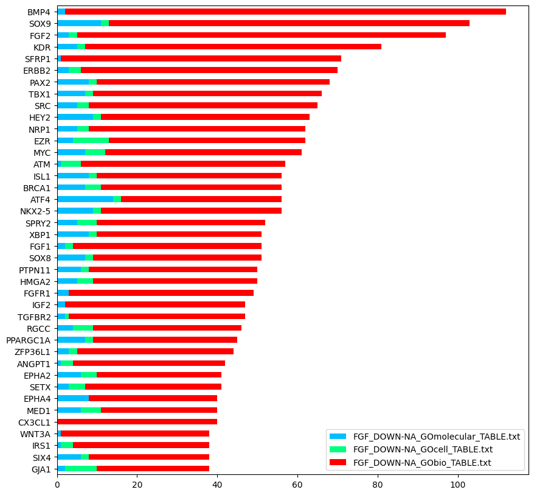

# Bioinformatics
## Basic tools to plot data from a project on genes

### Tools include:
  * [`main.py`](https://github.com/NikHoffStyl/DanaesBioMedSciProject/main.py) 
  which is used to plot histograms of all numeric columns in the data files
  and plot scatter plots of some or all of those columns.

| Combined Score                                            | Log p-value                                       | Odds Ratio | Overlap                                                   |
|-----------------------------------------------------------|---------------------------------------------------|------------|-----------------------------------------------------------|
|  |  | |  |
|  |  | |  |

It is also outputs the count of genes per pathway in a horizontal bar chart (see example below).
  

    
  

  * [`plotPvalAndGeneCount.py`](https://github.com/NikHoffStyl/DanaesBioMedSciProject/plotPvalAndGeneCount.py) 
  which is used to plot the ln(p-value) and gene count in horizontal bar charts for the most statistically significant
  results (see example below).
  

    

* [`getPathways.py`](https://github.com/NikHoffStyl/DanaesBioMedSciProject/getPathways.py) 
  which is used to list the pathways associated to specific genes. 
  See [`geneTables.txt`](https://github.com/NikHoffStyl/DanaesBioMedSciProject/geneTables.txt) 
  for example lists.

* [`compareRaw.py`](https://github.com/NikHoffStyl/DanaesBioMedSciProject/compareRaw.py) 
  which is used to show which genes are included in more than one data file (in this case, inhibition FGF or BMP).

